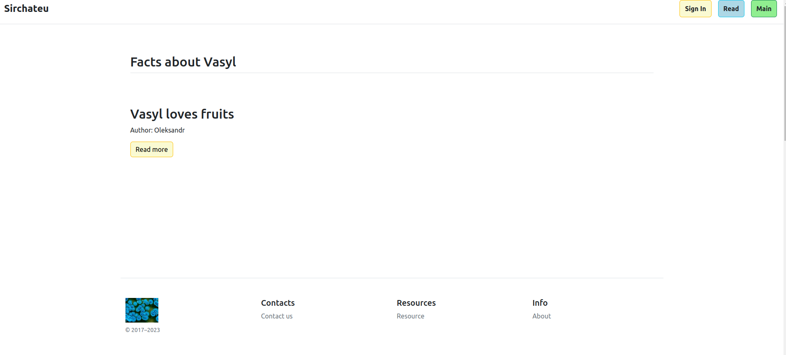

# :technologist: Flask App
This is a simple web application developed using the Flask framework in Python. This was created only to practice writing code.

## :eyes: Overview
This Flask app demonstrates the basic structure of a Flask web application and includes the following features:

- User authentication and authorization with Flask-Login and Flask-Security.
- Database integration using SQLAlchemy for handling user data.
- Basic CRUD (Create, Read, Update, Delete) operations for managing user accounts.
- Templating with Jinja2 for rendering dynamic web pages.
- Simple routing and URL handling with Flask's built-in routing system.
- Bootstrap CSS framework for responsive and visually appealing user interface.

P.S. This <b>Overview</b> section was fully generated by ChatGPT :smile:

## :student: Main Idea
During my student years, we(me and my group) had a lot of fun with two people, actually, amazing people, who were really great and made us a lot of fun. We love them so much. I decided to create a website on Flask where the users(actually only our group) can post and read related information about these two people(like brief stories).

## License
This project is licensed under the [GNU General Public License v3.0](https://github.com/molfaryura/flask-app/blob/main/LICENSE).

## Contact
If you have any questions, comments, or suggestions, please feel free to contact me at oleksandrr1996@protonmail.com
